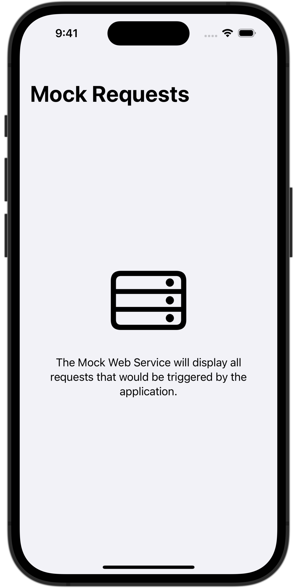
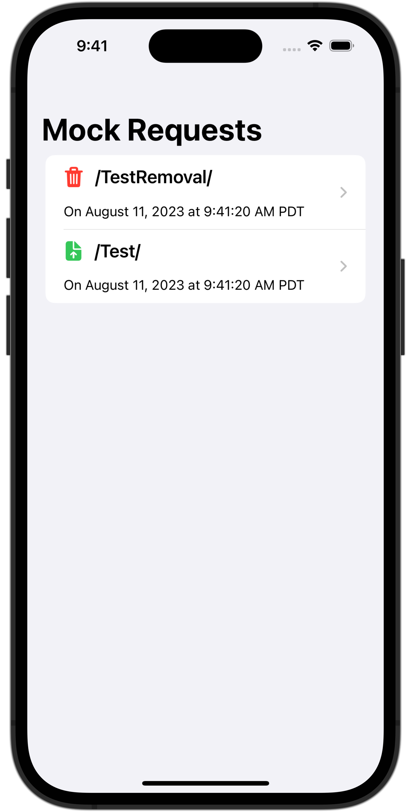
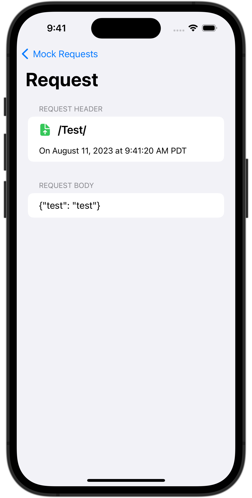

<!--
                  
This source file is part of the Stanford Spezi open source project

SPDX-FileCopyrightText: 2022 Stanford University and the project authors (see CONTRIBUTORS.md)

SPDX-License-Identifier: MIT
             
-->

# SpeziMockWebService

[](https://github.com/StanfordSpezi/SpeziMockWebService/actions/workflows/build-and-test.yml)
[](https://codecov.io/gh/StanfordSpezi/SpeziMockWebService)
[](https://doi.org/10.5281/zenodo.8239945)
[](https://swiftpackageindex.com/StanfordSpezi/SpeziMockWebService)
[](https://swiftpackageindex.com/StanfordSpezi/SpeziMockWebService)


Mock the interaction with a web service in a Spezi-based application.


## Overview

The Spezi Mock Web Service Swift Package provides a [Spezi Component](https://swiftpackageindex.com/stanfordspezi/spezi/documentation/spezi/component) ([`MockWebService`](https://swiftpackageindex.com/stanfordspezi/spezimockwebservice/documentation/spezimockwebservice/mockwebservice)) to mock the interaction with a web service and display the requests in a user interface that can be used for demonstrations and debugging purposes ([`RequestList`](https://swiftpackageindex.com/stanfordspezi/spezimockwebservice/documentation/spezimockwebservice/requestlist)).

<p float="left">
    <p>
        
        The landing page of the <a href="https://swiftpackageindex.com/stanfordspezi/spezimockwebservice/documentation/spezimockwebservice/requestlist">RequestList</a>.
    </p>
    <p>
        
        The <a href="https://swiftpackageindex.com/stanfordspezi/spezimockwebservice/documentation/spezimockwebservice/requestlist">RequestList</a> provides an overview of all sent requests.
    </p>
    <p>
        
        The detail view of a single request.
    </p>
</p>

       
## Example

The following example demonstrates the usage of the Swift Package in a SwiftUI `View`, accessing the [`MockWebService`](https://swiftpackageindex.com/stanfordspezi/spezimockwebservice/documentation/spezimockwebservice/mockwebservice) using the `@EnvironmentObject` property wrapper.
The `ExampleView` displays the [`RequestList`](https://swiftpackageindex.com/stanfordspezi/spezimockwebservice/documentation/spezimockwebservice/requestlist) in a `NavigationStack` and has a private function that uses the injected [`MockWebService`](https://swiftpackageindex.com/stanfordspezi/spezimockwebservice/documentation/spezimockwebservice/mockwebservice) to call the [`MockWebService/upload(path:body:)`](https://swiftpackageindex.com/stanfordspezi/spezimockwebservice/documentation/spezimockwebservice/mockwebservice/upload(path:body:)) and [`MockWebService/remove(path:)`](https://swiftpackageindex.com/stanfordspezi/spezimockwebservice/documentation/spezimockwebservice/mockwebservice/remove(path:)) functions, mocking the interaction with a real web service.

```swift
import SpeziMockWebService
import SwiftUI


struct ExampleView: View {
    @EnvironmentObject var webService: MockWebService
    
    
    var body: some View {
        NavigationStack {
            RequestList()
            // ...
        }
    }
    
    
    private func sendMockUploadRequests() async throws {
        try await webService.upload(path: "Test", body: #"{"test": "test"}"#)
        try await webService.remove(path: "TestRemoval")
    }
}
```

For more information, please refer to the [API documentation](https://swiftpackageindex.com/StanfordSpezi/SpeziMockWebService/documentation).


## Contributing

Contributions to this project are welcome. Please make sure to read the [contribution guidelines](https://github.com/StanfordSpezi/.github/blob/main/CONTRIBUTING.md) and the [contributor covenant code of conduct](https://github.com/StanfordSpezi/.github/blob/main/CODE_OF_CONDUCT.md) first.


## License

This project is licensed under the MIT License. See [Licenses](https://github.com/StanfordSpezi/SpeziContact/tree/main/LICENSES) for more information.


